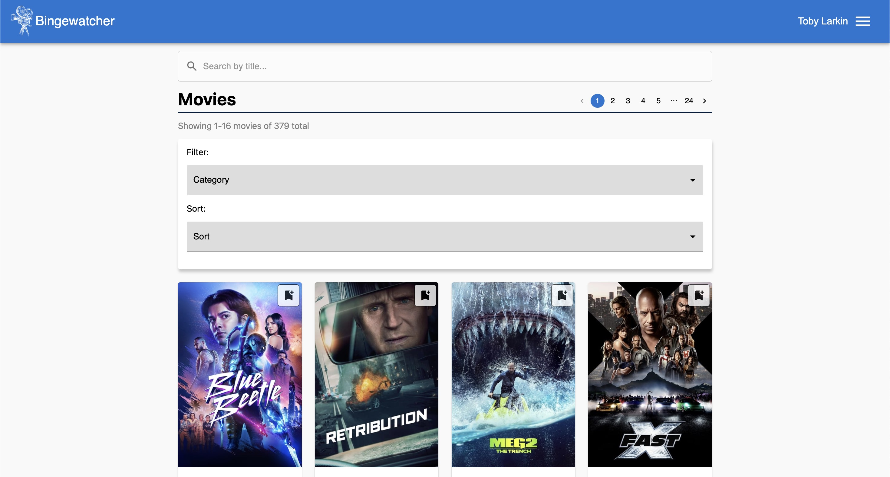

# Bingewatcher 

Binge Watcher is a platform to search for movies and TV shows. The user can search for movies and TV shows, and add them to a watchlist. The user can also rate movies and TV shows, and see the average rating of each movie and TV show.

The user can search for movies and TV shows by typing in the search bar. The user can also filter the search results by selecting a category. The user can add movies and TV shows to a watchlist by clicking the "Add to watchlist" button. The user can also rate movies and TV shows by clicking the "Rate" button. The user can see the average rating of each movie and TV show by hovering over the rating. The personal rating is per user, and the average rating is for all users.



The project can be found at:

> http://it2810-16.idi.ntnu.no/project2/

> <i>Note: You need to be connected to NTNU's network to access the project. Either directly or through VPN.</i>

## Documentation

This readme is intended to provide a brief overview of the project setup and available npm scripts.
Other documentation can be found in the [docs](./docs) folder.

## Project structure

The project is divided into two main folders: `client`, `server`.

### Client

The `client` folder contains the frontend code for the project.

The client documentation can be found in the [client/README.md](./client/README.md) file.

### Server

The `server` folder contains the backend code for the project.

The server documentation can be found in the [server/README.md](./server/README.md) file.

### Root

The `root` has its own `package.json` file, and is used to install dependencies common for the entire project. This includes Typescript, Eslint and Prettier. It also contains scripts for easy initialization of the client, server or both (if set up from before).

## Environment

The system is built on node v20.5.0 and npm v9.8.1. We cannot guarantee that other versions of node will run the project without complications.

To set correct node version, run:

```cli
nvm install 20.5.0
```

```cli
nvm use 20.5.0
```

> <i>Note: The project cannot be run with node 20.6.0.</i>

To set correct npm version, run:

```cli
npm install -g npm@9.8.1
```

The project have been developed and tested with Google Chrome, and therefore is best viewed in Google Chrome. Certain features may not work as intended in other browsers.

## Setup

### Basic setup

To setup the project for development, run:

```cli
npm run setup
```

This will concurrently install all dependencies for the project.

For client spesific setup, please follow instructions located in [./client/README.md](./client/README.md#run-the-client).

Once client is setup up, run:

```cli
npm run dev:client
```

> <i>Client spesific scripts will only be available when the shell is located in the `client` directory. Please navigate to the directory if you wish to use them or have more flexability.</i>

<hr />

### Local server

If you wish to set up a local backend server, please follow instructions located in [./server/README.md](./server/README.md#configuration).

> **Note**: You will need a valid database connection to run the server locally.

Once configured properly, start the server by running:

```cli
npm run dev:server
```

> <i>Server spesific scripts will only be available when the shell is located in the `server` directory. Please navigate to the directory if you wish to use them or have more flexability.</i>

<hr>

If both client and server is set up correctly, you can use the following script to run both the client and server concurrently in the same terminal:

```cli
npm run dev
```

This will start the project in development mode. The project will run locally on a local ports, initialized by Vite and node. Any code changes will trigger automatic browser- and server updates.

<i> Overview over all the scripts can be found in the section below.</i>

## Available NPM Scripts

This section provides an overview of the available npm scripts for this project. These scripts help you manage development, testing, building, and other maintenance tasks for the project.

### Setup

| <div style="width:200px">Command</div> | Description                                                                                                           |
| -------------------------------------- | --------------------------------------------------------------------------------------------------------------------- |
| `npm install`                          | Installs dependencies for `root`.locally.                                                                             |
| `npm run setup`                        | Concurrently installs dependencies in `root`, `client` & `server`.                                                    |
| `npm run setup:nonconcurrent`          | Sequencially installs dependencies in `root`, `client` & `server`.                                                    |
| `npm run dev`                          | This script starts client & server concurrently in development mode. Any code changes will trigger automatic updates. |
| `npm run dev:client`                   | This script starts client in development mode. Any code changes will trigger automatic browser updates.               |
| `npm run dev:server`                   | This script starts server in development mode. Any code changes will trigger automatic updates.                       |

### Test

| <div style="width:200px">Command</div> | Description                                                                                                                                                                                                        |
| -------------------------------------- | ------------------------------------------------------------------------------------------------------------------------------------------------------------------------------------------------------------------ |
| `npm run test`                         | Runs all the test files in the entire project. <b>Note:</b> You must [set up Playwright](./docs/playwright.md) for this to work.                                                                                   |
| `npm run test:client`                  | Runs tests in the `./client` using Vitest and Playwright. <b>Note:</b> You must [set up Playwright](./docs/playwright.md) for this to work.                                                                        |
| `npm run test:server`                  | This script runs tests in the server using Vitest. It will execute all tests in the `./server` directory.                                                                                                          |
| `npm run coverage:client`              | This script runs tests with code coverage using Vitest. After completion, it will generate code coverage reports that you can find in your project. You can find the reports [here](./client/coverage/index.html). |

### Code Quality

| <div style="width:200px">Command</div> | Description                                                                                                                                                              |
| -------------------------------------- | ------------------------------------------------------------------------------------------------------------------------------------------------------------------------ |
| `npm run lint`                         | Runs ESLint to check TypeScript and TypeScript-related files in the project for style errors and code issues. It will also report any unused ESLint-disable directives.  |
| `npm run lint:fix`                     | Runs ESLint with the --fix flag to automatically fix formatting issues and style errors in project files.                                                                |
| `npm run lint:style`                   | Runs Stylelint to check CSS files in the project for style errors and code issues.                                                                                       |
| `npm run lint:style:fix`               | Runs Stylelint with the --fix flag to automatically fix formatting issues and style errors in project files.                                                             |
| `npm run format`                       | Runs Prettier to format the code in TypeScript, JavaScript, SCSS, JSON, and CSS files in the project according to the configuration defined in the .prettierrc.cjs file. |

### Production

| <div style="width:200px">Command</div> | Description                                              |
| -------------------------------------- | -------------------------------------------------------- |
| `npm run build:client`                 | This script builds the client for production using Vite. |

### CI/CD

| <div style="width:200px">Command</div> | Description                                           |
| -------------------------------------- | ----------------------------------------------------- |
| `npm run pipeline`                     | This script will simulate the CI/CD pipeline locally. |
