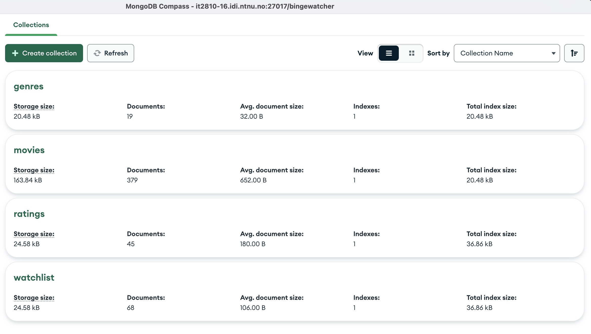
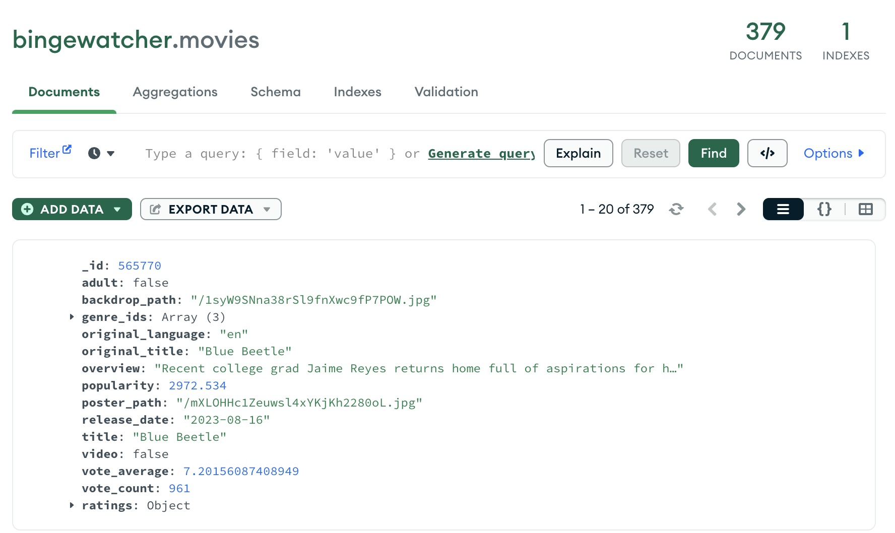
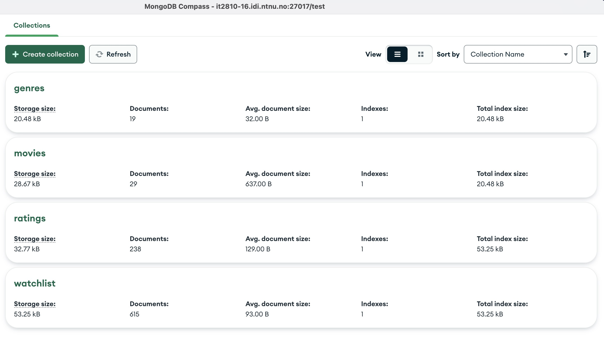

# Database

This project uses MongoDB as database. It is hosted on our virtual machine at NTNU.

There are two databases: `production` and `test`. The `production` database is used and meant strictly for production. The `test` database is used for development and testing.

## Dataset

The dataset used for this project is a subset from [The Movie DB](https://www.themoviedb.org).

## Collections

The database contains the following collections:

- `movies` - Contains the movies of the application.
- `categories` - Contains the categories of the application.
- `ratings` - Contains the ratings of the application.
- `watchlist` - Contains the watchlist for a user

### Production Database

##### Example movie

### Testing & Development Database

## Production

The production database contains 379 movies. It is connected to the server running in the VM. It is possible to connect to the production database from your local environment by starting the server in `production` mode. Follow the instructions [here](../server/README.md).

## Test & Development

The test database contains significantly less movies than the production database. This is to keep the development- and testing environment simple and fast.
The main goal behind the testing database is to have a predictable database to run the tests from.

> For a bigger project we would have opted to have a third database by splitting the `test` database into two separate, one for development and one for testing. This would have made it easier to keep the testing environment clean and predictable, by ensuring development actions would not influence the data in the test environment.

### Back to [documentation](./README.md).
