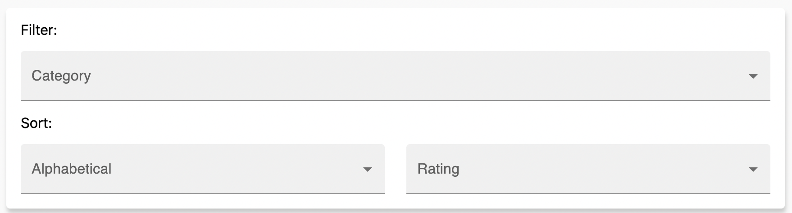

# Feeback from fellow students on P2

This document contains the feedback we received from fellow students after the deliveries. We have divided the feedback into P2-1 and P2-2, Some of the feedbacks that were frequently mentioned are collected into one feedback in this document. The feedbacks are translated from Norwegian to English. We have furthered reflected on the feedbacks and written down our thoughts about them. After making improvements, we have written down what we have done to improve the feedbacks.

# P2-1

## Remove filtering and sorting on the page of movies

### Feedback

When I sort alphabetically and don't want to sort again, nothing happens. You might want to consider making the page revert to default when clicking “none” for sorting. This applies to both sorting by rating and alphabetically.

### Our reflection

We have not thought about this before, we will look into how we can implement this.

### Improvements

We have changed the functionality after selecting none, to make a new fetch when value changes.

## Design of the detailed movie page

### Feedback

- Some design elements have padding and rounded corners, while others don't.
- Some design elements use dark color tones, whereas others are light.
- The background doesn't seem to have a consistent fill, causing the generic background image for the page to cut through.
- On the movie page, there should be added margin or padding at the bottom to provide some space below the text.
- The background might be confusing in terms of contrast. Suggestions include blurring the background or changing its color.

### Our reflection

This is usefull feedback on the design of the movie page. We will try to redesign the page to make it more user friendly.

### Improvements

Fixed in [#43](https://gitlab.stud.idi.ntnu.no/it2810-h23/Team-16/prosjekt-2/-/issues/43) and implemented with [!23](https://gitlab.stud.idi.ntnu.no/it2810-h23/Team-16/prosjekt-2/-/merge_requests/23)

We have done some redesign of the detailed movie page to increase the usability of the page. Much focus on readability and user friendlyness.

## Go back button on the detailed movie page

### Feedback

There's a need for a back button on the detailed movie page. Currently, users have to click on the site's logo to navigate back.

### Our reflection

We have not thought about this before. We wil add a back-button on the detailed movie page. This function should also remember the previous state of page, genre, and sorting.

### Improvements

Fully implemented in [!46](https://gitlab.stud.idi.ntnu.no/it2810-h23/Team-16/prosjekt-2/-/issues/46) and [!47](https://gitlab.stud.idi.ntnu.no/it2810-h23/Team-16/prosjekt-2/-/issues/47).

A back button is added to the detailed movie page. Global state is used to remember the previous state of page, genre, and sorting.

## Functionality when logged in vs logged out

### Feedback

There's a functionality that allows users to add movies to a watchlist even when they are not logged in, but these movies don't actually get added to a watchlist. This is confusing for users.

### Our reflection

This is a bug we have not thought about before. We should fix this bug similar to have the rating works. When a user is not logged in, the user should be able to just read about the movies, not rate or put to watchlist.

### Improvements

Implicitly implemented with other updates, but fixed in.

## Search functionallity

### Feedback

The search feature only navigates to individual movie results, rather than displaying multiple results at once.

### Our reflection

We will look into how much functionality we can add to the search functionallity. As it is now the functionallity is limited, and we will look into how we can improve it. We consider this as a task requiring a lot of time, and we will look into it if time allows it.

# P2-2

## Design choice of filtering and sorting

### Feedback

I would combine the sorting menus, since one (obviously) cannot use both at the same time. I don't see the advantage of having two different dropdown menus when they have the same functionality.

**Before:**

### Our reflection

We have not thought about this before. We have now combined the sorting menus into one. This should be done to make the page more user friendly.

### Improvements

After feedback from peer review, we have combined the sorting menus into one. This is done to make the page more user friendly.

Solved in [!42](https://gitlab.stud.idi.ntnu.no/it2810-h23/Team-16/prosjekt-2/-/merge_requests/42/commits)

## Filtering result count

### Feedback

It is not possible to see how many movies I have before/after filtering.

### Our reflection

This is true, we have not impelemented a count for the results. We will look into how we can implement this.

### Improvements

A total count of the filterede result is now displayed above the sorting and filtering menu.

Fixed in [#70](https://gitlab.stud.idi.ntnu.no/it2810-h23/Team-16/prosjekt-2/-/issues/70) and implemented in [!42](https://gitlab.stud.idi.ntnu.no/it2810-h23/Team-16/prosjekt-2/-/merge_requests/42).

## Filter and sort clear button

### Feedback

I would add a button to reset the filters and sorting. Right now, if I have chosen sorting and filtering, I have to go into both and choose “None” to reset them.

### Our reflection

This is a valid point. We have now added a clear button to reset the filters and sorting. We have decided to keep the filters if the user navigates to another page, but the filters and sorting will be reset if the user refreshes the page.

### Improvements

Added a clear button to reset the filters and sorting. The filters and sorting will be reset if the user refreshes the page. The button will not be visible if the filters and sorting are not set. This is done to not mislead the user to think that the button has functionality.

Fixed in [#69](https://gitlab.stud.idi.ntnu.no/it2810-h23/Team-16/prosjekt-2/-/issues/69) and implemented in [!42](https://gitlab.stud.idi.ntnu.no/it2810-h23/Team-16/prosjekt-2/-/merge_requests/42).

## Searching for movies

### Feedback

I wish there was a connection between search and filtering/sorting/pagination. Right now, they are separate, and it's not possible to use them interchangeably. This means, for example, I can't see which of the movies in a film series is the highest rated.

### Our reflection

This is a good idea. We will look into how we can implement this if time allows it.

### Conclusion

We have not implemented this, but we have added a search button to the search field. This is done to make it more clear that the user can search for movies. Because of time constraints, we have not implemented the functionality to search for movies and later add them to the list in the UI. This is because we that would have needed to change all resolvers we are now using to fetch data based on the search query as well.

## Static genres-file to map genre-ids to genre-names

### Feedback

It's missing fetching categories from the database. Here you are using a hardcoded 'categories.json'.

### Our reflection

This is something we should fix. We should use the database to fetch the categories. When fetching a movie, we can populate the categories with the genre-ids, and then get data from the database to get the genre-names.

### Improvements

Solved as described over in [#65](https://gitlab.stud.idi.ntnu.no/it2810-h23/Team-16/prosjekt-2/-/issues/65) and implemented in [!35](https://gitlab.stud.idi.ntnu.no/it2810-h23/Team-16/prosjekt-2/-/merge_requests/35).

## Watchlist button

### Feedback

The watchlist button is small, and it's not clear what it does. I would make it bigger and add a describing text.

### Our reflection

We have not thought about this before. We should make the watchlist button bigger and add a text to it. In combination with the hidden link to watchlist page, it is not clear that it exists a watchlist page and functionality.

### Improvements

We have made the watchlist button bigger and added a text to it. We have made it more clear that the hamburgermenu-button is a button, and not just a hamburgermenu-icon. We belive this will make it more clear that the watchlist page exists.

Solved in [#68](https://gitlab.stud.idi.ntnu.no/it2810-h23/Team-16/prosjekt-2/-/issues/68) and implemented in [!41](https://gitlab.stud.idi.ntnu.no/it2810-h23/Team-16/prosjekt-2/-/merge_requests/41).

## Rating movies interract with the database

### Feedback

The rating system is not connected to the database. This means that the ratings are not saved when the page is reloaded.

### Our reflection

As it is now, we have saved the rating to the database, but it is not affecting the data about the movie. We should look into how we can make the rating affect the data about the movie.

### Improvements

We have now implemented a new handling of the rating. We are stil storing the rating in the "ratings" database, but we are now also updating the rating data in the "movies" database. This is done by calculating a new average and incrementing the number of ratings.
Fixed in [#62](https://gitlab.stud.idi.ntnu.no/it2810-h23/Team-16/prosjekt-2/-/issues/62) and implemented in [!39](https://gitlab.stud.idi.ntnu.no/it2810-h23/Team-16/prosjekt-2/-/merge_requests/39)

## User Logic

### Feedback

1. If you log out and refresh the page, you are logged in.

2. I am a little confused - it looks like you generate random usernames and such if you try to log in?

### Our reflection

This is a bug we have not noticed before. We will implement a new user-logic to make sure the user does not automatically get logged in.

About the implementation of user, it is true that we generate random usernames. Full exnplenation of this can be found in the [README.md](../README.md) file.

### Improvements

We are now using a local storage value to check if the user should be automatically logged in, or not. This is done to make sure the user does not automatically get logged in if the user refreshes the page after logging out.

Fixed in [#66](https://gitlab.stud.idi.ntnu.no/it2810-h23/Team-16/prosjekt-2/-/issues/66) Implemented in [!38](https://gitlab.stud.idi.ntnu.no/it2810-h23/Team-16/prosjekt-2/-/merge_requests/38).

### Back to [documentation](./README.md).
